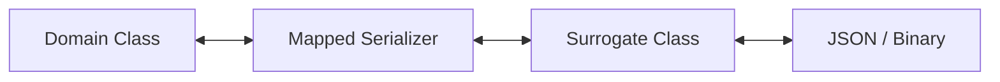

# 🏗️ Konstruct

**Konstruct** is a powerful Kotlin Symbol Processor (KSP) designed to automatically generate `kotlinx.serialization` serializers and deserializers using the **Surrogate Pattern**.

[](https://github.com/lilgallon/konstruct/actions/workflows/build.yml)
[](https://github.com/lilgallon/konstruct/releases)
[](LICENSE)

---

## 🌟 Why Konstruct?

Serialization is easy when you control the source code. But what if you need to serialize:
- **Third-party classes** that aren't annotated with `@Serializable`?
- classes where you want to **separate your domain model** from its wire representation?
- classes that require **complex custom mapping** logic?

**Konstruct** solves this by generating **surrogate data classes** and **mapped serializers** automatically, saving you from writing thousands of lines of boilerplate code.

---

## 🛠️ Installation

Add the dependency to your `build.gradle.kts`:

```kotlin
repositories {
    mavenCentral()
    maven { url = uri("https://maven.pkg.github.com/lilgallon/konstruct") }
}

dependencies {
    // Both are required for the single artifact
    implementation("dev.gallon:konstruct:1.0.0")
    ksp("dev.gallon:konstruct:1.0.0")
}
```

---

## 📖 Usage

### Basic Example

Annotate any class (typically a configuration class) with `@GenerateSerializers` to trigger the generation:

```kotlin
import konstruct.annotations.GenerateSerializers

@GenerateSerializers(
    classes = [
        User::class,
        Product::class
    ]
)
class MyAppSerializers
```

Konstruct will generate:
- `UserSurrogate` & `ProductSurrogate`
- `UserSerializer` & `ProductSerializer`
- `GeneratedSerializersModule`

### Using the Generated Serializers

```kotlin
import konstruct.generated.generatedSerializersModule
import kotlinx.serialization.json.Json

val json = Json {
    serializersModule = generatedSerializersModule
}

// Now you can serialize/deserialize User even if it's not @Serializable
val user = User(id = 1, name = "John Doe")
val encoded = json.encodeToString(UserSerializer, user)
val decoded = json.decodeFromString(UserSerializer, encoded)
```

### Custom Serializers

You can override defaults at the class or field level:

```kotlin
@GenerateSerializers(
    classes = [MyClass::class],
    customClassSerializers = [
        CustomClassSerializer(targetClass = Instant::class, serializer = MyInstantSerializer::class)
    ],
    customFieldSerializers = [
        CustomFieldSerializer(
            targetClass = MyClass::class,
            fieldSerializer = [
                FieldSerializer(name = "secretField", serializer = EncryptedSerializer::class)
            ]
        )
    ]
)
class MySerializers
```

---

## 🧠 Approach: The Surrogate Pattern

Konstruct uses the **Surrogate Pattern**. Instead of serializing your domain class directly, it serializes a "shadow" data class (the surrogate) that is annotated with `@Serializable`.



This ensures that your domain model remains pure and untouched by serialization details, while still being fully serializable.

---

## 🤝 Contributing

Contributions are welcome! Whether it's reporting a bug, suggesting a feature, or submitting a pull request.

1. Fork the repository.
2. Create your feature branch (`git checkout -b feature/amazing-feature`).
3. Commit your changes (`git commit -m 'Add some amazing feature'`).
4. Push to the branch (`git push origin feature/amazing-feature`).
5. Open a Pull Request.

---

## 🏆 Credits

This project was originally built for [IZIVIA OCPI Toolkit](https://github.com/IZIVIA/ocpi-toolkit).

### Contributors
- **Lilian Gallon** (@lilgallon) - Lead Developer

---

## 📄 License

This project is licensed under the MIT License - see the [LICENSE](LICENSE) file for details.
